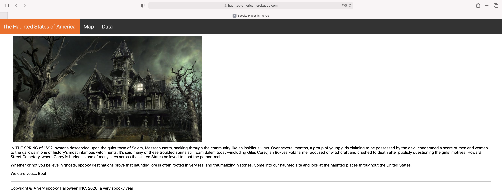
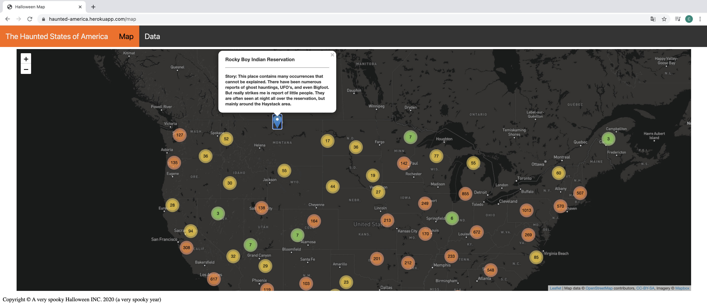
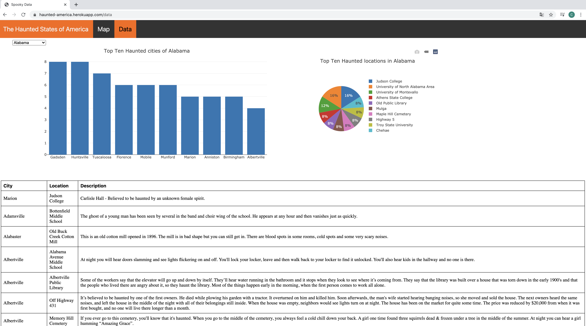

# The Haunted States of America

Wouldn’t it be cool to have a site where you could find haunted places? This is a site with interactive dashboards to explore haunted locations and a cursed map to locate them. Try it!

## Description

1. Data.js

Use Data.js to build a bar chart with the top 10 haunted cities by state, a pie chart with the top 10 haunted locations by state and a table with the full list of the spooky cities and locations of the selected state.

2. Map.js

Use map.js to display a clustered map with all the locations across America, locate the places and display some spooky stories.

3. Heroku

Deploy the Flask App to Heroku

  * Use the heroku postgres add on
  * Use the provided schema.sql to create the tables.
  * Use the option Import/Export of the table to import the data from the haunted_locations.csv file

4. Flask API

Use app.py to serve the data needed for the dashboards and map

  * Test the next route in the browser to get all the markers on the map, all the locations:
  
  <https://haunted-america.herokuapp.com/api/locations>

  * Test the next route in the browser for the charts, by state, which only displays the information of the state selected by the user: 
  
  https://haunted-america.herokuapp.com/api/state

5. Heroku Deployment

<https://haunted-america.herokuapp.com>

## Screenshots

### Home page

### Map page

### Data page

## Team members

1. Cristobal Bugeda
2. Eduardo Garza
3. Luis Cavazos
4. Cintia Mercado

